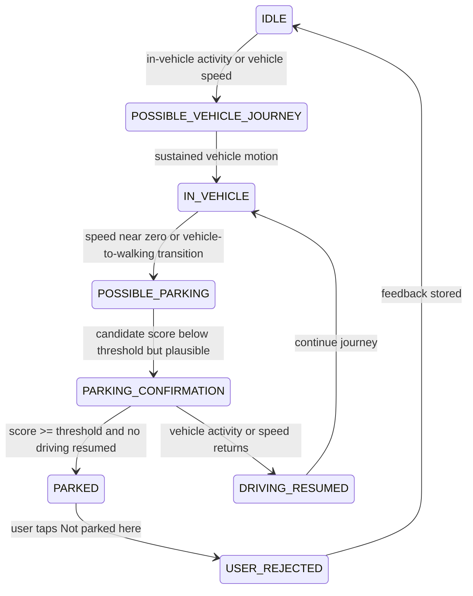

# Parking Detection State Machine

The candidate is reset if driving resumes during confirmation. The saved location is selected from the rolling driving buffer rather than the final walking location.
